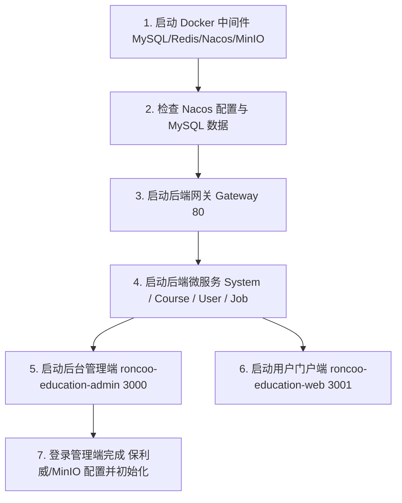

# 领课教育系统环境配置与第三方服务接入指南

本文档汇总领课教育系统（roncoo-education-full）的**开发与生产运行环境要求**、**基础中间件配置**、**保利威（POLYV）音视频云接入**、**对象存储配置（MinIO / 阿里云 OSS）**及**常见问题排查**。

---

## 目录

- [一、基础运行环境要求](#一基础运行环境要求)
- [二、中间件与数据库初始化](#二中间件与数据库初始化)
- [三、第三方服务配置说明](#三第三方服务配置说明)
  - [1. 音视频云（保利威 POLYV）配置](#1-音视频云保利威-polyv-配置)
  - [2. 领课云说明（关于是否需要配置）](#2-领课云说明关于是否需要配置)
  - [3. 对象存储（MinIO 与 阿里云 OSS）配置](#3-对象存储minio-与-阿里云-oss-配置)
  - [4. 短信平台与 AI 配置](#4-短信平台与-ai-配置)
- [四、服务启动与联调顺序](#四服务启动与联调顺序)
- [五、默认账户与用户系统说明](#五默认账户与用户系统说明)
- [六、常见问题与注意事项](#六常见问题与注意事项)

---

## 一、基础运行环境要求

| 组件 | 最低版本要求 | 推荐版本 | 说明 |
| :--- | :--- | :--- | :--- |
| **JDK** | 17+ | OpenJDK 17 或 21 | 后端 Spring Boot 3.5.0 / Spring Cloud 2025.0.0 必需 |
| **Node.js** | 18.18+ / 20+ | Node.js v20.x LTS | 前端管理端（Vite）与门户端（Nuxt 3）必需 |
| **MySQL** | 8.0+ | MySQL 8.0.30+ | 字符集推荐 `utf8mb4` |
| **Redis** | 6.0+ | Redis 7.x | 缓存与分布式会话 |
| **Nacos** | 2.2.0+ | Nacos 2.4.x | 服务注册与配置中心 |
| **Seata** | 2.0.0+ | Seata 2.0+ | 分布式事务协调（可选/按需） |
| **XXL-JOB** | 2.4.0+ | XXL-JOB 2.4.x | 分布式定时任务调度 |
| **MinIO** | 最新版 | MinIO RELEASE.2023+ | 本地/私有化对象存储 |

---

## 二、中间件与数据库初始化

### 1. 使用 Docker Compose 一键启动中间件

在 `resources/` 目录下提供了一体化部署脚本：

```bash
cd resources
docker compose -f docker-compose.yml up -d
```

> 该 Compose 包含了 MySQL 8、Redis、Nacos、XXL-JOB、Seata 及 MinIO 服务。

### 2. 数据库脚本初始化

如手动部署 MySQL，请依次执行 `resources/` 或 `resources/mysql-init/sql/` 目录下的 SQL 脚本：

* `os_system.sql`：系统管理库（含基础参数 `sys_config`、权限、用户等）
* `os_user.sql`：用户与会员库
* `os_course.sql`：课程、分类、点播资源、直播等业务库
* `os_job.sql`：XXL-JOB 任务调度库

### 3. Nacos 配置导入

解压或导入 `resources/nacos_config/` 或 `resources/nacos_config.zip` 到 Nacos 的 `DEFAULT_GROUP` 与 `SEATA_GROUP` 命名空间中。

---

## 三、第三方服务配置说明

系统的业务参数均统一存储在 `sys_config` 表中，可在 **后台管理端【系统管理】->【系统配置】** 页面进行可视化修改，修改后实时生效或通过初始化刷新。

### 1. 音视频云（保利威 POLYV）配置

系统默认支持 **保利威（POLYV）** 提供的点播（VOD）和直播（Live）服务。

#### ① 获取保利威 API 凭据
前往保利威开发者控制台获取对接参数：
🔗 **保利威 API 接口设置页面**：[https://my.polyv.net/secure/setting/api?lang=zh_CN](https://my.polyv.net/secure/setting/api?lang=zh_CN)

在控制台中可以获取以下 6 项核心凭证：
1. **User ID** (`userId`)
2. **点播 Write Token** (`writeToken`)
3. **点播 Read Token** (`readToken`)
4. **点播 Secret Key** (`secretKey`)
5. **App ID** (`appId`)
6. **App Secret** (`appSecret`)

#### ② 系统后台配置步骤
1. 登录管理后台，进入 **【系统管理】 -> 【系统配置】 -> 【音视频配置】**。
2. 将 **点播平台 (`vodPlatform`)** 切换为 **保利威**（值为 `2`）。
3. 将 **直播平台 (`livePlatform`)** 切换为 **保利威**（值为 `2`）。
4. 依次填入上面获取到的 6 项保利威参数并保存。
5. 点击页面右侧的 **「视频初始化」** 按钮：
   * 系统将自动向保利威注册视频上传回调地址（`gateway/course/callback/polyv/vod/upload`）。
   * 自动配置 Playsafe 防盗链与 Web 授权播放设置。

---

### 2. 领课云说明（关于是否需要配置）

* **问：领课云（领客云）可以不配置吗？**
* **答：完全可以不配置！**
  * “领课云”是领课网络官方自研的商业私有云服务（属于增值定制服务）。
  * 本系统采用平台插件化设计：
    * **视频点播**：只要点播平台切换为「保利威」，领课云相关配置项（`priyUrl`、`priyAccessKeyId`、`priyAccessKeySecret`）保持默认 `-` 即可，系统不会请求领课云接口。
    * **短信平台**：如果不用领课云短信，可切换为「阿里云短信」或在测试阶段直接查询数据库验证码。

---

### 3. 对象存储（MinIO 与 阿里云 OSS）配置

系统内置支持 **MinIO**（私有化部署）和 **阿里云 OSS**（公网云存储），可在后台【系统配置】->【存储配置】中自由切换。

#### 方案 A：MinIO（推荐本地开发、测试与私有化部署）

| 配置项 (`configKey`) | 默认值示例 | 说明 |
| :--- | :--- | :--- |
| `storagePlatform` | `2` | 存储平台选择 **MinIO** |
| `minioAccessKey` | `minioadmin` | MinIO Access Key |
| `minioSecretKey` | `minioadmin` | MinIO Secret Key |
| `minioEndpoint` | `http://127.0.0.1:9000` | MinIO 服务端接口地址 |
| `minioBucket` | `education` | 存储桶名称（系统会自动检测并创建） |
| `minioDomain` | `http://127.0.0.1:9000/` | 文件公网访问域名（**须以 `/` 结尾**） |
| `minioPreviewUrl` | `https://file.kkview.cn/` | kkFileView 文档在线预览服务地址 |

#### 方案 B：阿里云 OSS（推荐公网线上生产环境）

| 配置项 (`configKey`) | 说明 |
| :--- | :--- |
| `storagePlatform` | `3`（存储平台选择 **阿里云**） |
| `aliyunAccessKeyId` | 阿里云 RAM 访问密钥 ID |
| `aliyunAccessKeySecret` | 阿里云 RAM 访问密钥 Secret |
| `aliyunOssEndpoint` | 区域节点，例如：`https://oss-cn-guangzhou.aliyuncs.com` |
| `aliyunOssBucket` | OSS Bucket 名称 |
| `aliyunOssUrl` | 自定义域名或 OSS 访问域名（**须以 `/` 结尾**） |

---

### 4. 短信平台与 AI 配置

* **短信平台 (`smsPlatform`)**：
  * `1` 为领课云短信，`2` 为阿里云短信（需配置 `aliyunSmsAccessKeyId`、`aliyunSmsSignName`、`aliyunSmsAuthCode` 等）。
* **AI 助手 (`aiBaseUrl`)**：
  * 默认支持 OpenAI 兼容格式接口，例如配置为 `https://api.openai.com` 或代理地址，即可在管理端开启 AI 生成课程大纲与文案功能。

---

## 四、服务启动与联调顺序



### 1. 后端服务启动命令（IDEA / Maven）
依次启动各模块主类：
1. `GatewayApplication`（网关）
2. `SystemApplication`（系统基础服务）
3. `CourseApplication`（课程与音视频服务）
4. `UserApplication`（用户与认证服务）
5. `JobApplication`（定时任务服务，可选）

### 2. 前端服务启动命令

* **后台管理端**：
  ```bash
  cd roncoo-education-admin
  npm install
  npm run dev
  # 访问 http://localhost:3000 ，默认管理员账号 admin / 123456
  ```

* **用户前台**：
  ```bash
  cd roncoo-education-web
  npm install
  npm run dev
  # 访问 http://localhost:3001
  ```

---

## 五、默认账户与用户系统说明

系统采用管理端（`os_system.sys_user`）与学员端（`os_user.users`）物理分库分表隔离设计。

### 1. 管理端默认账户（后台管理系统）
* 访问地址：`http://localhost:3000`
* **超级管理员**：手机号 `18800000000` / 密码 `123456`
* **演示只读用户**：手机号 `13300000000` / 密码 `123456`

### 2. 学员端默认账户（用户门户系统）
* 访问地址：`http://localhost:3001`
* **测试学员账号**：手机号 `13800000000`（或 `13800138001`） / 密码 `123456`

#### ① 无短信通道时的注册/重置方法
系统内置开发免短信机制：在前台点击「获取验证码」后，后端 `roncoo-education-service-user` 控制台会以黄色 WARN 日志直接打印出 6 位验证码（如 `手机号：xxx，验证码：123456`），直接输入控制台打印的验证码即可完成注册。

#### ② 一键 SQL 初始化测试学员与钱包账户
如需直接在数据库初始化一个可直接登录且带有 1000 元购课余额的测试学员：

```sql
-- 1. 初始化学员账号（密码：123456）
INSERT INTO os_user.users (id, status_id, mobile, mobile_salt, mobile_psw, nickname, register_source)
VALUES (20260816001, 1, '13800000000', '543ad4d8a2a748a19600e1ef147a4063', '4f2eb1b947faca9df6ee7bf681f37ffd68639f59', '测试学员', 11)
ON DUPLICATE KEY UPDATE 
  mobile_salt = '543ad4d8a2a748a19600e1ef147a4063',
  mobile_psw = '4f2eb1b947faca9df6ee7bf681f37ffd68639f59';

-- 2. 初始化该学员的资产/钱包账户（充值 1000.00 余额，并计算防篡改 sign）
INSERT INTO os_user.users_account (id, status_id, user_id, available_amount, freeze_amount, sign)
VALUES (20260816001, 1, 20260816001, 1000.00, 0.00, MD5('202608160011000.000.00'))
ON DUPLICATE KEY UPDATE 
  available_amount = 1000.00,
  sign = MD5(CONCAT(user_id, '1000.00', '0.00'));
```

---

## 六、常见问题与注意事项

1. **保利威视频上传后无法播放 / 转码中**：
   * 请确认保利威后台的 **回调设置** 是否能正确访问你的后端网关公网地址（本地开发可通过 内网穿透/ngrok 工具映射 `gateway/course/callback/polyv/vod/upload`）。
   * 确保在系统后台点击了「视频初始化」完成授权。
2. **余额支付报错「该用户账户异常，不允许使用余额支付」**：
   * 系统对学员余额有防篡改校验，`sign` 必须等于 `MD5(user_id + available_amount + freeze_amount)`。
   * 在 `os_user` 库执行 `UPDATE users_account SET sign = MD5(CONCAT(user_id, available_amount, freeze_amount));` 即可一键修复。
3. **MinIO 图片/附件上传失败**：
   * 请确保 MinIO 服务已启动，且 `minioDomain` 和 `minioEndpoint` 正确填写。
   * 系统会自动将 `education` 桶的 `public/` 路径设置为公开读取策略。
4. **密码解密失败 / RSA 报错**：
   * 系统登录使用 RSA 非对称加密传输密码，请确保 `sys_config` 表中 `rsaLoginPublicKey`（前端公钥）与 `rsaLoginPrivateKey`（后端私钥）配对正确（默认 SQL 已包含有效配对）。

